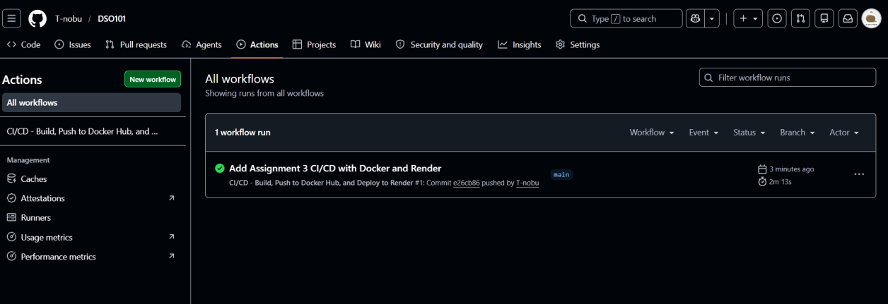
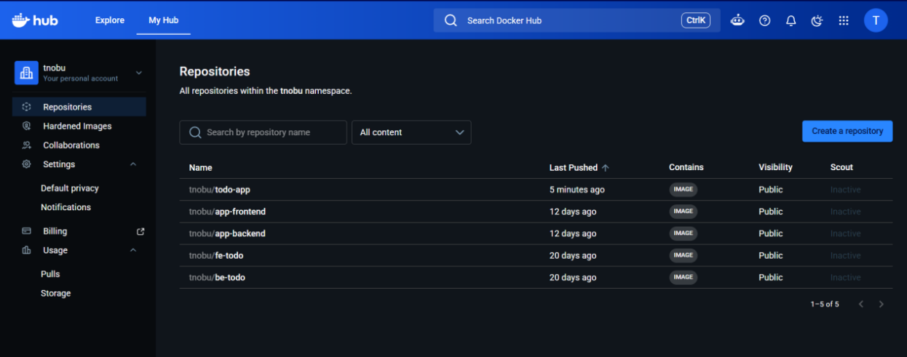

# Assignment 3 Report 

---

## What I did

I automated build, push, and deploy for a Node.js Todo API using GitHub Actions.

**Task 1 — Repository**
- Public repo on GitHub with `start`, `test`, and Docker scripts in `A3/package.json`
- Jest tests in `A3/__tests__/server.test.js` (6 tests, all passing)

**Task 2 — Docker**
- `A3/Dockerfile`: Node 20 Alpine, `npm install`, `npm test`, port 3000
- Tested with `docker compose up --build` on my machine

**Task 3 — GitHub Actions**
- Workflow: `.github/workflows/deploy.yml` (repo root — required by GitHub)
- On push to `main`: checkout → Docker Hub login → build `./A3` → push `todo-app:latest` → call Render webhook
- Secrets: `DOCKERHUB_USERNAME`, `DOCKERHUB_TOKEN`, `RENDER_DEPLOY_WEBHOOK_URL` (no passwords in code)

**Task 4 — Render**
- Web service: **Deploy existing image** → `tnobu/todo-app:latest`
- Port 3000, `DOCKER_ENV=true`, health check at `/health`

---

## Screenshots included

1. GitHub Actions — successful workflow run 

 
2. Docker Hub  

---

## Challenges

- **Alpine + SQLite:** `better-sqlite3` needed `python3`, `make`, and `g++` in the Dockerfile.  
- **Render does not auto-pull:** New Docker Hub pushes do not redeploy alone; I added Render’s deploy webhook in the workflow.  
- **Workflow path:** The YAML must live in `.github/workflows/` at the repo root, not inside `A3/` only.

---

## What I learned

- GitHub Actions replaces manual `docker build` and `docker push` after every merge  
- Secrets keep tokens safe while still automating deploy  
- Webhooks link CI (GitHub) to CD (Render) without logging into Render each time  

