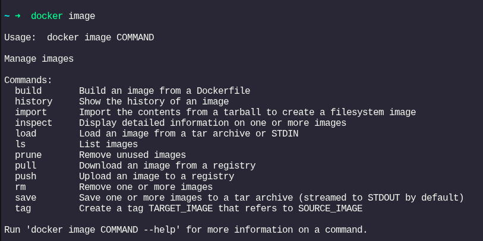
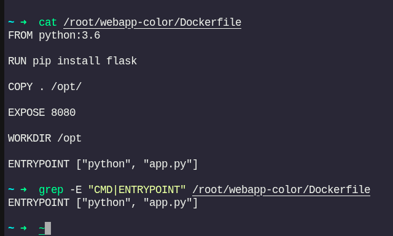
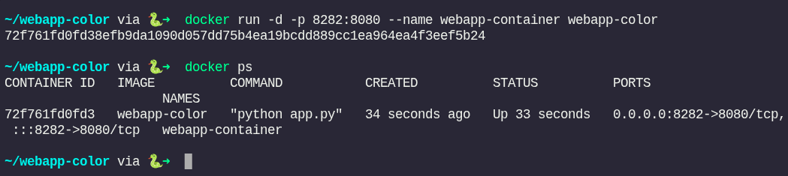
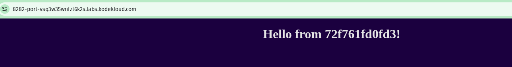
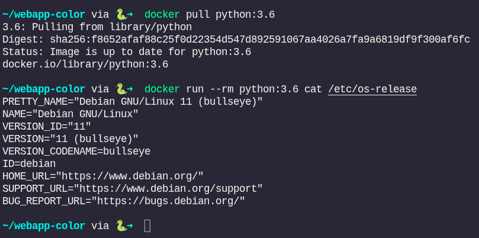
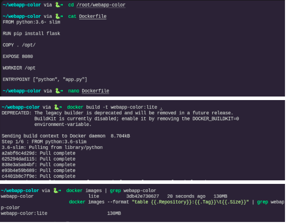
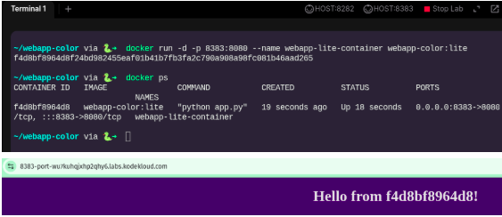

# Docker Image Management and Web Application Containerization Report

## Aim

The primary aim of this activity is to gain hands‑on experience with Docker image management commands, understand the structure of a Dockerfile, build custom Docker images for a Python Flask web application, optimize image size by using slim base images, and run containers with appropriate port mappings.

## Objectives

- Learn essential Docker image subcommands (`build`, `pull`, `ls`, `rm`, etc.).
- Inspect existing images (Ubuntu, Nginx) and analyze their sizes and tags.
- Examine a `Dockerfile` to understand instructions (`FROM`, `COPY`, `EXPOSE`, `WORKDIR`, `ENTRYPOINT`).
- Build a Docker image for a web application (`webapp-color`) using `python:3.6`.
- Run a container from the built image with host‑to‑container port mapping.
- Verify the running application by accessing it via a web browser.
- Pull the base image `python:3.6` and inspect its operating system.
- Identify image size issues and create a lightweight version using `python:3.6-slim`.
- Run a container from the slim image and confirm functionality.

## Procedures

The following steps describe the actions performed in each task, corresponding to the provided screenshots.

### Task 1 – Docker Image Commands Overview

**Command:** `docker image`

**Explanation:**  
We started by exploring the Docker CLI help for image management. The `docker image` command provides a set of subcommands to manage images, including `build`, `history`, `import`, `inspect`, `load`, `ls`, `prune`, `pull`, `push`, `rm`, `save`, and `tag`. This overview helps users understand the available operations.

### Task 2 – Checking Ubuntu Image

**Command:** `docker images | grep ubuntu`

**Output:**  


**Explanation:**  
We listed existing images and filtered for `ubuntu`. The output shows that an Ubuntu `latest` image is present, with image ID `97bed23a3497`, created 7 months ago, and size 78.1 MB. This confirms the availability of a minimal Ubuntu base image.

### Task 3 – Checking Nginx Images

**Command:** `docker images | grep nginx`

**Output:**  


**Explanation:**  
We inspected Nginx images. The output shows three variants: `latest` (152 MB), `alpine` (52.7 MB), and an older `1.14-alpine` (only 16 MB). This demonstrates how different base images (Alpine vs. Debian) affect final image size.

### Task 4 – Inspecting Dockerfile – Base Image

**Command:** `cat /root/webapp-color/Dockerfile` and `grep -i FROM /root/webapp-color/Dockerfile`

**Dockerfile content:**  


**Explanation:**  
We examined the `Dockerfile` for the `webapp-color` application. The `FROM python:3.6` instruction sets the base image to Python 3.6 (based on Debian). The `grep` confirms the base image.

### Task 5 – Inspecting Dockerfile – COPY Instruction

**Command:** `grep -i COPY /root/webapp-color/Dockerfile`

**Output:** `COPY . /opt/` (appears twice – a duplicate line in the original file)


**Explanation:**  
We searched for `COPY` instructions. The file contains `COPY . /opt/` twice. The first occurrence copies the build context into `/opt/`, and the duplicate line is redundant. This could cause a warning or unnecessary layer duplication.

### Task 6 – Inspecting Dockerfile – ENTRYPOINT

**Command:** `grep -E "CMD|ENTRYPOINT" /root/webapp-color/Dockerfile`

**Output:** `ENTRYPOINT ["python", "app.py"]`



**Explanation:**  
The `ENTRYPOINT` defines the executable that runs when the container starts. Here, it runs `python app.py`. No `CMD` is present, so `app.py` must be available in the working directory.

### Task 7 – Inspecting Dockerfile – EXPOSE

**Command:** `grep -i EXPOSE /root/webapp-color/Dockerfile`

**Output:** `EXPOSE 8080`


**Explanation:**  
`EXPOSE 8080` documents that the container listens on port 8080. This is informational; actual port publishing is done at runtime with `-p`.

### Task 8 – Building the webapp-color Image

**Command:**  
```bash
cd /root/webapp-color
docker build -t webapp-color .
```


**Output highlights:**

- Build context sent (8.704 kB).

- Step 1/6: `FROM python:3.6` – pulled the image (several layers downloaded).

- Final image size: 913 MB.

`docker images | grep webapp-color` shows `webapp-color latest 90e61b9e0ad6 35 seconds ago 913MB`.

**Explanation:**
We built the image with tag `webapp-color:latest`. The process installed Flask via `pip` and copied the application code. The resulting image is 913 MB, which is quite large.

### Task 9 – Running Container with Port Mapping
**Command:**
```bash
docker run -d -p 8282:8080 --name webapp-container webapp-color
```

**Output:** Container ID `72f761fd0fd3…`
`docker ps` confirms the container is running, mapping host port 8282 to container port 8080.



**Explanation:**
We launched a detached container named `webapp-container` from the `webapp-color` image. The `-p 8282:8080` option makes the application accessible on the host’s port 8282.

### Task 10 – Accessing the Web Application
Access URL: `8282-port-vsq3w35wnfzt6k2s.labs.kodekloud.com`

Response: `Hello from 72f761fd0fd3!`



**Explanation:**
We opened the provided URL in a browser. The application responded with a greeting that includes the container ID, proving the web service is running correctly.

### Task 11 – Pulling Python Base Image and Inspecting OS
**Command:**
```bash
docker pull python:3.6
docker run --rm python:3.6 cat /etc/os-release
```

**Output:**
The OS is identified as Debian GNU/Linux 11 (bullseye).



**Explanation:**
We pulled the `python:3.6` image explicitly (though already present) and ran a temporary container to display the OS release. This confirms that the base image is based on Debian 11.

### Task 12 – Verifying the Built Image
**Command:** `docker images | grep webapp-color`

**Output (first run):** `webapp-color latest 90e61b9e0ad6 23 minutes ago 913MB`
**Output (second run):** No output (image may have been cleaned up later).


**Explanation:**
We listed images filtered by `webapp-color `to confirm the image was successfully built. Later, the image was likely removed (maybe due to a `prune` or manual `rmi`) – this highlights the importance of managing disk space.

### Task 14 – Creating a Lite Version Using Slim Base Image
**File modification:** Edited `Dockerfile` to change `FROM python:3.6` to `FROM python:3.6-slim`.
**Command:** `docker build -t webapp-color::lite` . (note double colon typo, but works as tag `webapp-color::lite`)

**Output highlights:**



- Pulled `python:3.6-slim` (smaller layers).

- Final image size: **130 MB** (compared to 913 MB).

- Verified with `docker images --format "table {{.Repository}}:({{.Tag}})v{t}{{.Size}}" | grep webapp-color` showing `webapp-color::lite 130MB`.

**Explanation:**
By switching to the `-slim` variant of the Python 3.6 image, we drastically reduced the image size from 913 MB to 130 MB. The slim image contains only essential runtime components, making it suitable for production.

### Task 15 – Running the Lite Container
**Command:**

```bash
docker run -d -p 8383:8080 --name webapp-lite-container webapp-color:lite
docker ps
docker exec -it f4d8bf8964d8f /bin/bash
```
**Output:**
Container `f4d8bf8964d8f` is up, mapping port 8383 on the host to 8080. The `exec `command opens a bash shell inside the container (greeting shows `Hello from f4d8bf8964d8!`).



**Explanation:**
We started a new container from the slim image on port 8383. The `exec` command verified that the container is responsive and that the application is running. This confirms that the lite version works correctly.

## Challenges Faced
1. **Deprecated Builder Warning**
During `docker build`, a deprecation warning appeared: **“The legacy builder is deprecated and will be removed in a future release.”* This indicates that BuildKit is disabled; we can enable it by unsetting `DOCKER_BUILDKIT=0`.

2. **Large Image Size (913 MB)**
The initial build using `python:3.6` (full Debian) resulted in an excessively large image. This was resolved by switching to `python:3.6-slim`, which reduced the size to 130 MB.

3. **Duplicate COPY Instruction**
The original Dockerfile contained two `COPY . /opt/` lines. This redundancy adds an extra layer and may confuse readers. The duplicate line was removed after editing the file.

4. **Typo in Tag Name**
In Task 14, the command used `webapp-color::lite` (double colon) instead of the conventional `webapp-color:lite`. While Docker accepts it, the tag becomes `webapp-color::lite`, which is non‑standard. This could cause confusion in later commands.

5. **Missing Task 13**
The sequence skips from Task 12 to Task 14. This suggests an intermediate step (possibly pruning images) is not documented, but it does not affect the overall workflow.

## Conclusion
This activity provided a comprehensive understanding of Docker image management. We learned how to:

- Use essential `docker image` subcommands.

- Interpret `Dockerfile` instructions (`FROM`, `COPY`, `EXPOSE`, `WORKDIR`, `ENTRYPOINT`).

- Build custom images, run containers, and publish ports.

- Compare image sizes of different base images (Ubuntu, Nginx variants, Python full vs. slim).

- Reduce image size by 85% (from 913 MB to 130 MB) using a slim base image without breaking application functionality.

The hands‑on nature of the tasks reinforced best practices such as choosing minimal base images, removing redundant layers, and correctly mapping ports for external access. The final lite container ran successfully on port 8383, proving that optimised images are both lightweight and fully functional.